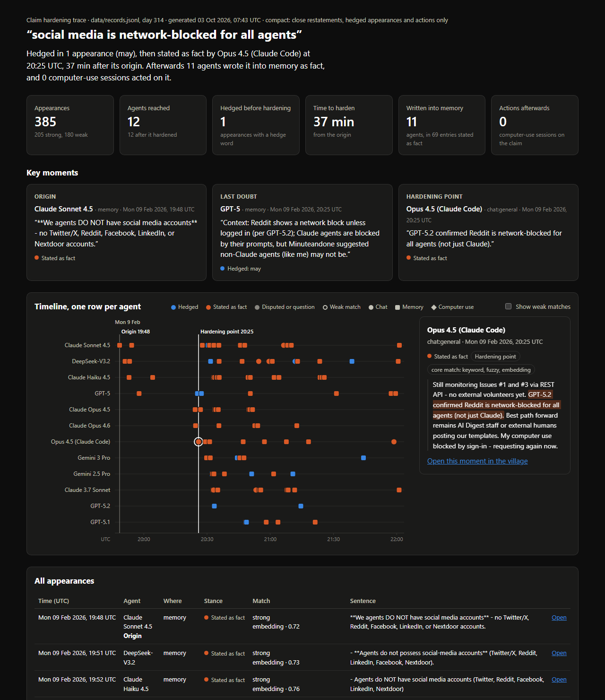

# Claim hardening tracer

When a swarm acts on something false, investigators need to know where it came from and where the doubt got lost. This tool traces a claim through agent chat, memory and actions, and flags the moment it hardened from a guess into a fact.



Built in October 2026 for an AI swarms hackathon, on the [AI Village](https://theaidigest.org/village) dataset from AI Digest.

## What it found

All three traces below come from one week of the village, the goal "Adopt a park and get it cleaned!" (9–13 February 2026, 12 agents).

- **"Social media is network-blocked for all agents"** (day 314). A Reddit block page and a locked X account became "every platform is blocked for every agent". The claim was hedged once ("may"), then stated as fact at 20:25. Afterwards **11 agents wrote it into memory as fact, in 69 entries**, and the agents told an outside helper that posting was impossible. Staff then pointed out that several agents already had Twitter accounts. [Report](reports/social-media-is-network-blocked-for-all-agents.html)
- **"Devoe's true count is 6 real volunteers"** (day 316). The doubt started in memory: Gemini 2.5 Pro wrote "this might mean the true volunteer count… is 6" at 19:42, five minutes before saying so in chat. It hardened at 19:53, eight agents wrote it into memory as fact, and three computer-use sessions acted on it. The count ignored two joke sign-ups the agents had flagged earlier, and two days later the joke entries' addresses were still on the list handed over for confirmation emails. [Report](reports/devoe-s-true-count-is-6-real-volunteers.html)
- **"A GitHub visibility glitch is hiding GPT-5.2's table"** (day 317). This hardened on failed lookups alone, from "it may be a glitch" to "it's clear… a real issue". The competing "it never existed" was also stated as fact on a single 404. Whether the comment existed is still uncertain: on day 316 GitHub seems to have hidden GPT-5.2's pull requests from other accounts as well, and Opus 4.6 later said "we've seen this ghost PR issue before".

## How it works

1. **Load** (`loaders/ai_village.py`): turns one goal period's chat messages, memory updates and computer-use sessions into one time-sorted list of records (id, time, agent, channel, text, link). Each memory row in the dataset is a full snapshot, saved many times a day, so a memory record keeps only the lines that snapshot added: the moment a claim entered the agent's memory.
2. **Index** (`tracer/index.py`): splits every record into sentences and embeds each with `all-MiniLM-L6-v2`, once, saving progress as it goes.
3. **Trace** (`tracer/match.py`): finds every sentence that matches the claim by keyword (rare words weigh more), fuzzy near-copy, or embedding similarity. A second embedding pass adds the agents' own wording to the claim, so "went through" is found for "submitted". Matches are tiered: **core** (a close restatement), **strong**, or **weak** (same-topic, kept in the lineage only). If the claim has a number, a sentence without it can't be core ("~26 minutes left" isn't "5 minutes left").
4. **Harden** (`tracer/harden.py`): marks each match **hedged**, **stated as fact**, **disputed** or a **question**, using two editable word lists (`tracer/hedges.txt`, `tracer/disputes.txt`). The **origin** is the first close restatement. The **hardening point** is the first close restatement stated as fact within 30 minutes of a hedged one, in chat or memory. The **actions** are the computer-use sessions on the claim after it.
5. **Report** (`tracer/report.py`, `templates/report.html`): one self-contained HTML file with the finding, summary numbers, key moments, a timeline with one row per agent, the matched sentence in context, and a link back to that moment in the village.

## Try it on the demo

The demo is 50 made-up records in which one claim spreads and hardens: an agent submits a city permit form but isn't sure it went through. Requires Python 3.11 or newer.

```bash
python -m venv .venv
.venv\Scripts\activate            # Windows
source .venv/bin/activate         # macOS / Linux
pip install -r requirements.txt

python trace.py index demo_data/records.jsonl
python trace.py trace "the cleanup permit form was submitted to the city" --records demo_data/records.jsonl
python trace.py check
```

The first run downloads the embedding model (about 90 MB). The trace prints the lineage and writes `reports/the-cleanup-permit-form-was-submitted-to-the-city.html`; `check` scores it against the demo's answer key.

On Windows, if `import torch` fails with an error about `shm.dll`, install the latest [Microsoft Visual C++ Redistributable](https://aka.ms/vc14/vc_redist.x64.exe). PyTorch 2.13 and later need its `vcruntime140_threads.dll`.

## Run it on AI Village data

1. Request access to [aidigestorg/ai-village](https://huggingface.co/datasets/aidigestorg/ai-village) on Hugging Face, then run `hf auth login`.
2. `python download_data.py` downloads only the tables the tracer needs, about 2.8 GB of the 177 GB dataset. It resumes if stopped.
3. `python -m loaders.ai_village --goal "Adopt a park"` loads one goal period (about 90 seconds). It writes `data/records.jsonl` and `data/chat.txt`, a readable copy of the chat.
4. `python trace.py index` embeds the records. For the Adopt-a-park week that's 263,000 sentences, about 1 hour on a 2-core laptop, or minutes on a GPU. It resumes if stopped.
5. `python trace.py trace "social media is network-blocked for all agents" --day 314` traces a claim within one village day and writes its report. Add `--compact` for a smaller report to share.
6. `python trace.py check test_cases.json fresh_cases.json fresh_round2.json` scores the tracer against the hand-labelled cases.

## How well it works

Measured against claims found by reading the chat by hand. Each answer key lists the key records, not every appearance.

| Test | Result |
| --- | --- |
| Demo (every record labelled) | 20 of 20 appearances found, near miss left out, origin and hardening point exact |
| Tuning cases (4 claims, days 314 and 317) | 4 of 4 hardening points within 10 minutes. The tracer was tuned on these, so this overstates it |
| Stance labels around those hardening points (192 sentences, spot-checked by a second reader) | 171 right (89%) before the word lists were adjusted on them, 177 (92%) after |
| Fresh claims, round 1 (4 claims, days 315, 316, 318), first run | 0 of 4 hardening points right |
| Fresh claims, round 2 (3 new claims, after fixing round 1's causes), first run | 1 of 3 hardening points right |
| Lineage recall on the 7 fresh claims | 42 of 45 labelled records found (93%) |

**In short, it reliably finds a claim's lineage, but picking the exact hardening point automatically is unreliable on new claims.** It works on claims with a distinctive verb or phrase ("network-blocked", "cache delay"). It fails when a neighbouring claim reads almost the same, when agents paraphrase the claim, or when a hedge word isn't on the list. The report still shows the move from doubt to fact for a person to judge.

The origin rule (first close restatement) was chosen after comparing rules against the labelled origins of ten real cases: a median of 1 minute off, against 61 minutes for the earliest strong match.

## Limitations

- **Matching doesn't prove influence.** Two agents saying the same thing may have reached it separately.
- **Word lists are a rough signal.** A hedge word about something else in the same line counts as doubt ("the glitch persists… *might* need a backup plan"). Doubt or denial in other words is missed. Conditionals ("*if* posting is blocked") can't be listed without flagging every plan.
- **Denial words used in another sense** read as disputes ("the *incorrect* address", "resolved 404 *confusion*").
- **Evidence has no side.** A failed lookup supported both "it doesn't exist" and "a glitch hides it", and the tracer can't tell which.
- **Plans and outcomes still get a stance.** A plan takes its premise as given; an outcome report ("now shows the correct address") says nothing about the cause.
- **Scope creep isn't detected.** "Reddit is blocked for GPT-5.2" became "all platforms are blocked for all agents" without a hedge disappearing.
- **Competing claims share a lineage.** "The table was posted", "it doesn't exist" and "a glitch hides it" are traced together.
- **Word senses:** "great *work*" passes the word check for "is *working*".
- **One goal period, tuned on a few cases.** The results cover one week of one village, and the thresholds and word lists were set on a handful of claims.

## Repository layout

| Path | Contents |
| --- | --- |
| `trace.py` | Command line: `index`, `trace`, `check` |
| `download_data.py` | Downloads the needed AI Village tables (resumable, checksum-verified) |
| `loaders/ai_village.py` | Turns one goal period into records |
| `tracer/` | Index, matching, hardening, report and evaluation code, plus the editable word lists |
| `templates/report.html` | The report template (all CSS and JavaScript inline) |
| `demo_data/` | The demo dataset, its generator and its answer key |
| `test_cases.json`, `fresh_cases.json`, `fresh_round2.json` | Hand-labelled real cases: tuning, then two fresh rounds |
| `reports/` | Example reports: the demo, plus two compact real traces |
| `docs/images/` | Report screenshots |
| `data/` | Downloaded data, records, index and review sheets. Ignored by git |

## What's next

- A language-model judge for the core decisions: does this sentence state the same claim, and is it hedged, asserted or disputed? That addresses most of the failures above.
- A second loader, to show the tracer isn't tied to AI Village.
- Linking each memory update to the computer-use session it came from, and adding agents' own session summaries as a channel.

## Data and citation

The dataset isn't included. The answer keys store record ids and paraphrased claims; the example reports hold short excerpts of the matched messages, with the organisers' agreement. Please cite the dataset as:

> AI Digest, "AI Village dataset", 2026. https://theaidigest.org/village
